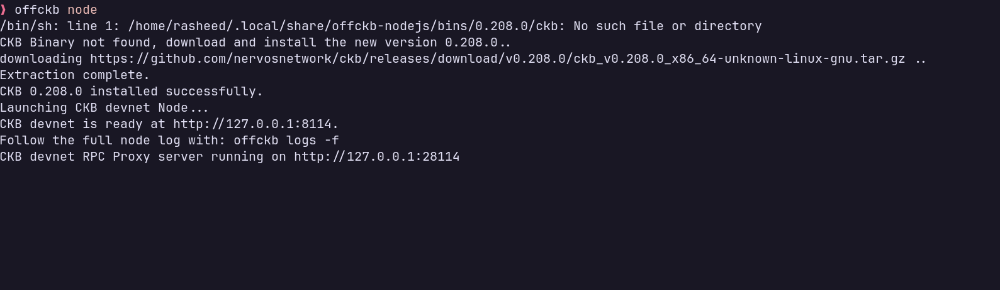
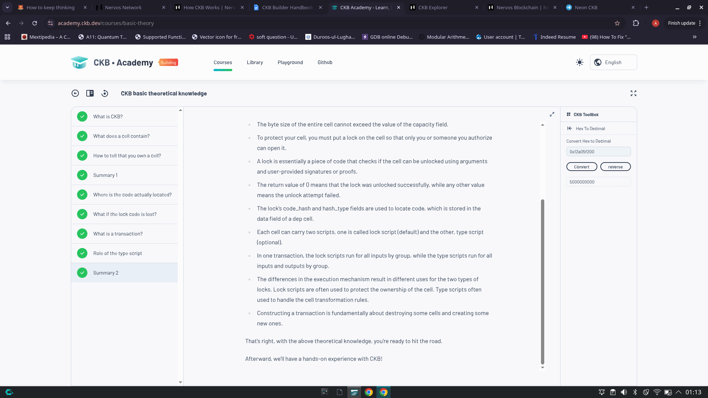
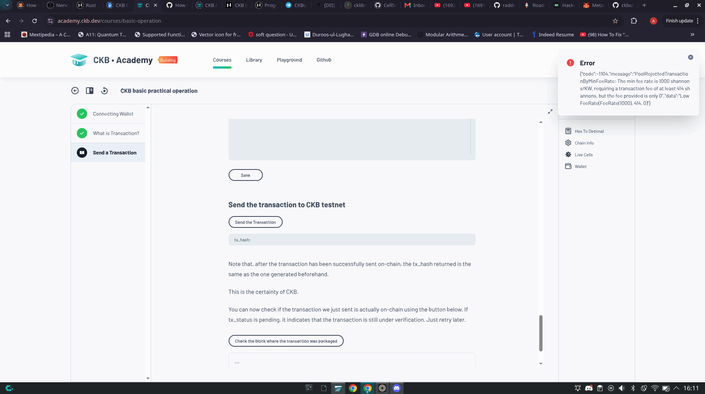

# Week 1 Report — CKBuilder Track

**Period:** August 9 – August 15, 2026
**Participant:** Abdulrasheed Fawole (bolaji1729)
**Track:** Builder

---

## Summary

This is an my first week as a CKBuilder and this week was spent on setting up my development environment and grokking the how CKB works and learning the Rust programming language.

---

## Completed This Week

### Enviroment Setup
- Installed the offckb cli tool.
- Successfully run a local devnet node.

### Grokking CKB

- Complete the CKB academy course 1 and 2.
- Developed deep understanding of how ckb works
- Went through practical session of making a CKB transaction
- Learnt about the CKB-VM

### Learning the Rust Programming Language

- Learnt basic rust programming language construct like variable, functions, datatypes, struct and enums.
- Developed basic understanding of the rust programming language ownership model.
- Read through chapters 1 to 6 of the rust programming language book.
- Finish exerxises 1 through 35 of rustlings.

**Links:**

- [How CKB works](https://docs.nervos.org/docs/getting-started/how-ckb-works)
- [Local Devnet Quick start](https://docs.nervos.org/docs/getting-started/quick-start)
- [My rustlings solution](https://github.com/Abdulrasheed1729/rustlings)

---

## Blockers

- I was unable to finish the transation in the lesson 2 of CKB academy.

---

## Plan for Week 2

- Fix the blocker fron this week
- Finish up the rust programming language book
- Build a simple json parser to solidify my rust skill.
- Write a simple CKB script with rust

