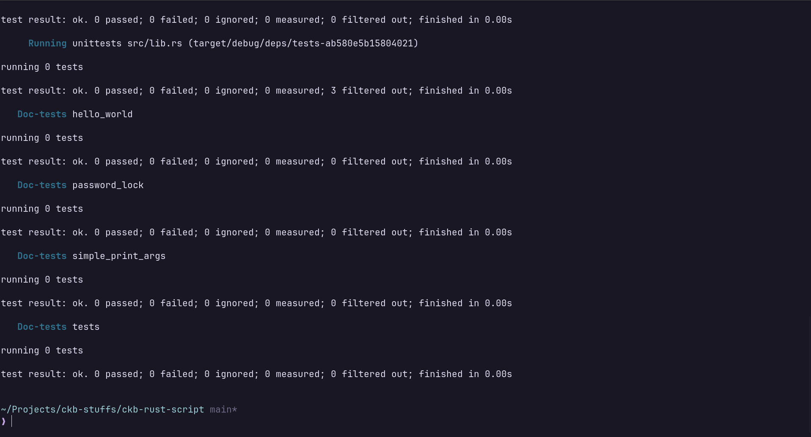
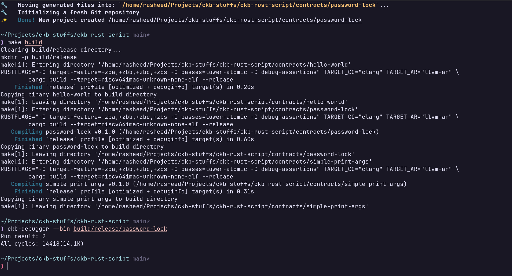
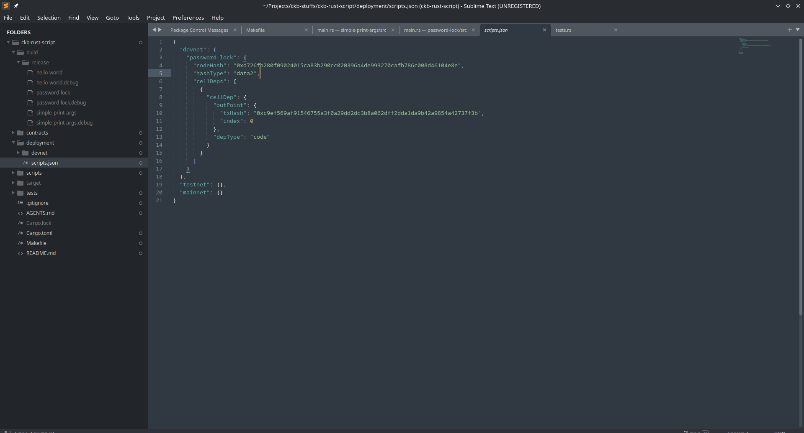
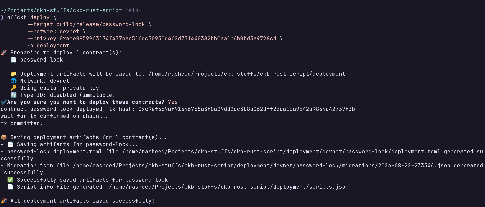
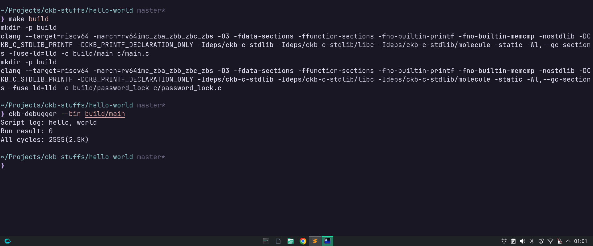

# Week 2 Report — CKBuilder Track

**Period:** August 17 – August 23, 2026

**Participant:** Abdulrasheed Fawole (bolaji1729)

**Track:** Builder

---

## Summary

This week was an introduction to writing script -- smart contracts -- with rust, how to use the devtools and also the contiunation of my journey learning the Rust programming language.

---

## Completed This Week

-  Fixes the blocker from last week

### Devtools, Syscalls and Scripts

- Went through truthixifiy's notes on CKB
	- Gained hands on experience on the theoretical details of CKB and scripts
- Read through RFC 0009, 0034 and 0050 for deep dive on details on script invocation via syscall
- Wrote an introductory and custom scripts with the Rust programming language
- Used the ckb-debugger to run and inspect scripts and run riscv64 executables
- Used the ckb-testtool to run tests on scripts
- Deployed a custom script to dvenet with the offckb cli tool.
- Bootstrapped an hello-world program with the ckb-c-stdlib and run with the ckb debugger

### Rust Programming

- Continued with the rust programming book
- Gained hands on experience with more of the language concepts like error handling, traits, lifetimes, writing unit tests

**Links:**

- [Truthixify's CKB notes](https://github.com/truthixify/learn-ckb-in-45-minutes)
- [CKB syscalls Docs](https://docs.nervos.org/docs/script/syscalls-for-script)
- [Rust contract quick start](https://docs.nervos.org/docs/script/rust/rust-quick-start)
- [RFC 0009](https://github.com/nervosnetwork/rfcs/blob/master/rfcs/0009-vm-syscalls/0009-vm-syscalls.md)
- [RFC 0034](https://github.com/nervosnetwork/rfcs/blob/master/rfcs/0034-vm-syscalls-2/0034-vm-syscalls-2.md)
- [RFC 0050](https://github.com/nervosnetwork/rfcs/blob/master/rfcs/0050-vm-syscalls-3/0050-vm-syscalls-3.md)
- [CKB C stdlib](https://github.com/nervosnetwork/ckb-c-stdlib)

---

## Blockers

- Finding it hard to grok the rust lifetime ellision construct
- In the script development I noticed some `unsafe` rust construct which I am not familiar with.

---

## Plan for Week 3

- Read some recommended articles on rust lifetimes
- Get familiar with some bits of unsafe rust
- Go through the L1 developer training course
