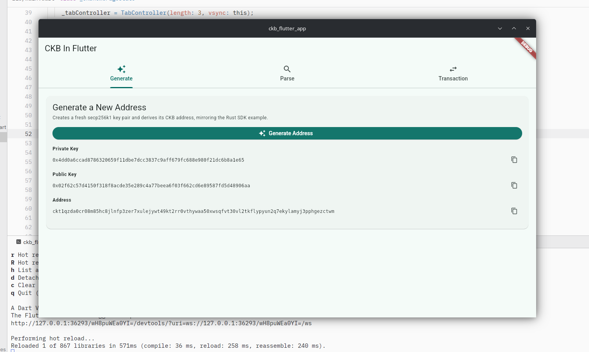
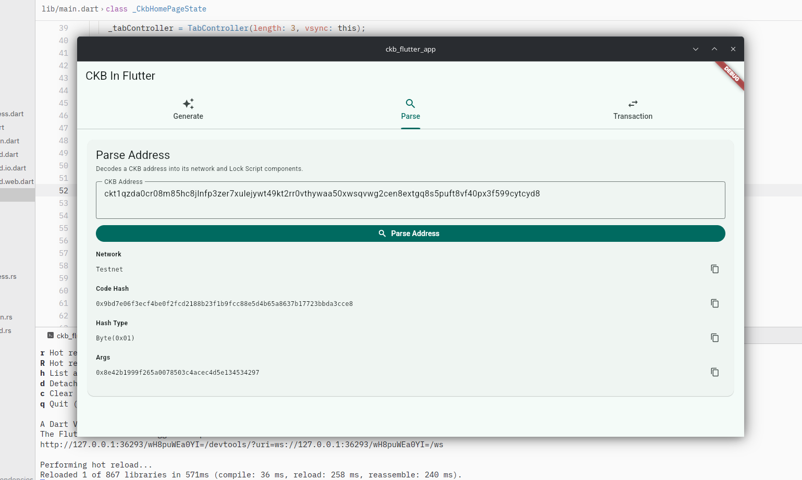
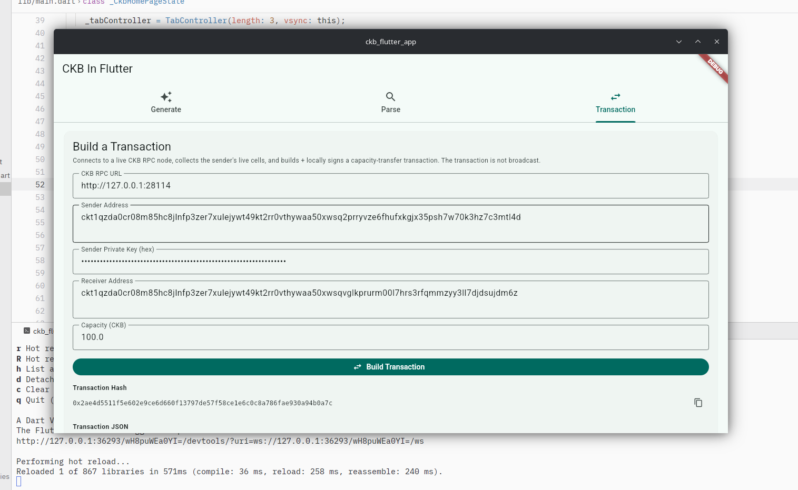

# Week 3 Report — CKBuilder Track

**Period:** August 24 – August 30, 2026

**Participant:** Abdulrasheed Fawole (bolaji1729)

**Track:** Builder

---

## Summary

The highlight of this week was going through the L1 tutorial, working with the Rust SDK, and taking a first stab at bringing CKB to the Flutter ecosystem via `flutter_rust_bridge`.

---

## Completed This Week

- Went through the L1 tutorial to better solidify my theoretical understanding of CKB transactions, scripts, etc.
- Went through the introductory page on the Rust SDK to learn about the SDK and its capabilities.
- Implemented a more modular custom Rust crate based on the docs examples.
- Got started with `flutter_rust_bridge` to interface between a Flutter app and a custom Rust crate.
- Implemented a simple Flutter UI to interact with the custom crate, which communicates with the CKB RPC.

#### Address Generation

#### Parse Address

#### A Simple Transaction

All screenshots above are from the app running on Flutter's Linux desktop target.

**Links:**

- [Rust SDK getting started](https://docs.nervos.org/docs/sdk-and-devtool/rust)

- [L1 training course](https://nervos.gitbook.io/developer-training-course)

- [Flutter Rust Bridge](https://github.com/fzyzcjy/flutter_rust_bridge)

- [CKB flutter app](https://github.com/Abdulrasheed1729/ckb_flutter_app)

---

## Blockers

- Unable to run the Flutter implementation on a mobile device due to **Gradle** issues.

---

## Plan for Week 4

- Explore the Rust SDK further and build more complex transactions.
- Resolve the Gradle issues blocking mobile builds of the Flutter app.
