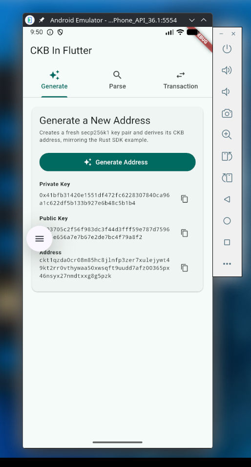
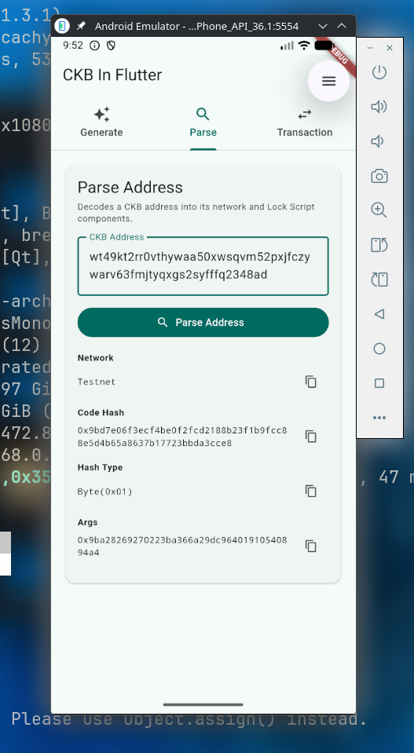
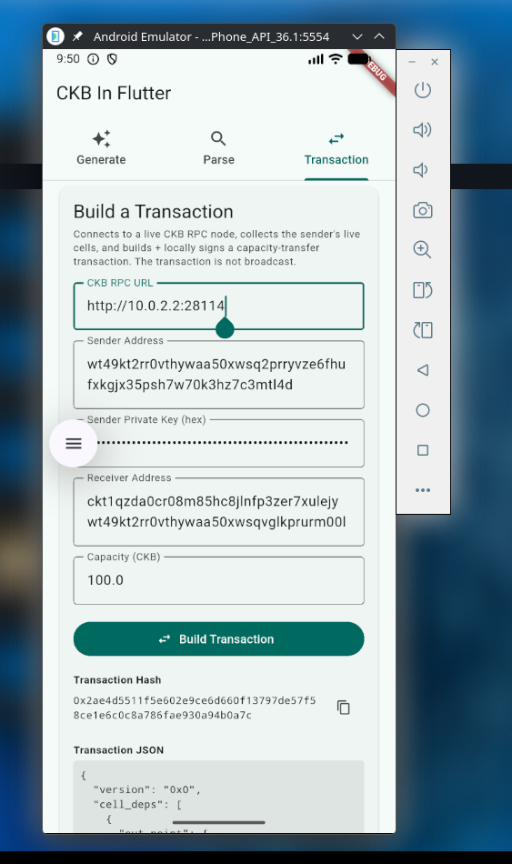

# Week 4 Report — CKBuilder Track

**Period:** September 07 – September 13, 2026

**Participant:** Abdulrasheed Fawole (bolaji1729)

**Track:** Builder

---

## Summary

This is week work was more of an environment setup for me, as most of the work done was troubleshooting Gradle, Rust on Android, SSL issues and clearing out the blocker from the previous week.

---

## Completed This Week

- Fix Gradle issues while running `ckb_flutter_app`.
- Troubleshoot issue encuntered with the openssl-sys cross compilation issue on Android emulator.
- Run the android version of the `ckb_flutter_app`
- Switched to rustls-tls feature of the `ckb-sdk`

#### Address Generation

#### Parse Address

#### A Simple Transaction

All screenshots above are from the app running on an Android Emulator.

**Links:**

- [Rust SDK getting started](https://docs.nervos.org/docs/sdk-and-devtool/rust)

- [CargoKit Github](https://github.com/irondash/cargokit)

- [Android Emulator Network Address Space](https://developer.android.com/studio/run/emulator-networking-address)

- [Flutter Rust Bridge](https://github.com/fzyzcjy/flutter_rust_bridge)

- [CKB flutter app](https://github.com/Abdulrasheed1729/ckb_flutter_app)

---

## Blockers

- Unable to explore the SDK docs further due to much time spent on troubleshoot the mobile development environment.

---

## Plan for Week 5

- Implement new dart-facing features from the SDK
- Replicate more transactions on the Docs
- Bootstrap a new project for a Dart CKB SDK.

